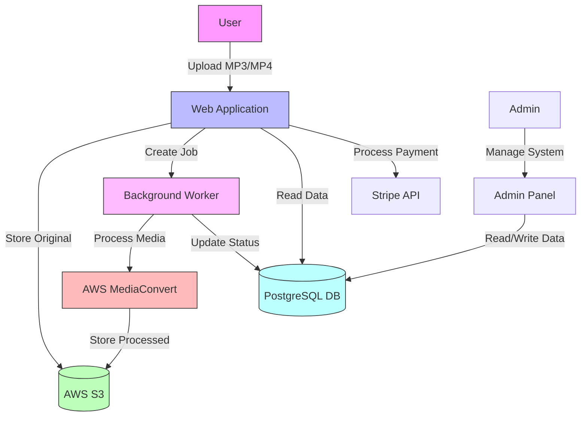
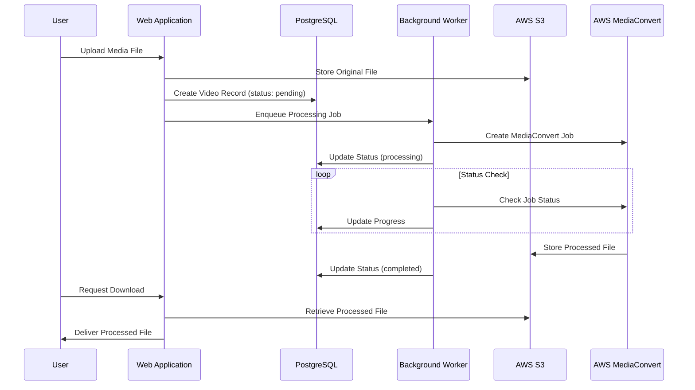
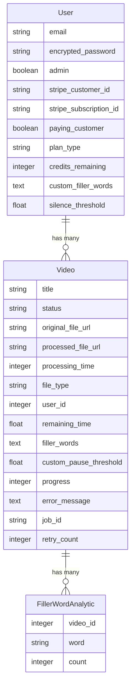

# Architecture for FillerWordsAI

## Status: Approved

## Technical Summary

FillerWordsAI is a web-based application built on the Speedrail (Rails 8) framework that automates the removal of filler words and awkward silences from audio and video content. The system employs a client-server architecture with AWS services integration for media processing. This architecture provides a scalable, user-friendly solution for podcasters and creative professionals who need to clean their recordings.

## Technology Table

| Technology         | Description                                                         |
|-------------------|---------------------------------------------------------------------|
| Rails 8           | Core web application framework                                       |
| Ruby 3.3.5        | Programming language                                                 |
| PostgreSQL        | Relational database for data persistence                             |
| AWS S3            | Cloud storage for original and processed media files                 |
| AWS MediaConvert  | Media processing service for removing filler words                   |
| Stripe            | Payment processing for subscriptions and one-time payments           |
| Devise            | Authentication system for user management                            |
| ActiveAdmin       | Administration dashboard                                             |
| Delayed           | Background job processing                                            |
| TailwindCSS       | CSS framework for responsive UI                                      |
| Flowbite          | UI component library built on TailwindCSS                            |
| RSpec             | Testing framework                                                    |
| Chartkick         | Data visualization for analytics                                     |

## Architectural Diagrams





## Data Models

### Entity Relationship Diagram



## API Integrations

### AWS MediaConvert

The application integrates with AWS MediaConvert to process media files:

```ruby
# Pseudo-code for MediaConvert service integration
class MediaConvertService
  def initialize(user)
    @user = user
    # AWS configuration
  end
  
  def create_job(video)
    # Create MediaConvert job with settings
    # Return job ID
  end
  
  def check_job_status(job_id)
    # Get job status from AWS
    # Return progress and time estimates
  end
end
```

### Stripe Payment API

The application integrates with Stripe for subscription and one-time payments:

```ruby
# Pseudo-code for Stripe integration
class SubscriptionService
  def create_subscription(user, plan_type)
    # Create Stripe subscription for user
  end
  
  def process_one_time_payment(user)
    # Process one-time payment and add credits
  end
end
```

## Project Structure

```
/
├── /app
│   ├── /controllers            # Application controllers
│   ├── /models                 # Data models (User, Video, FillerWordAnalytic)
│   ├── /views                  # UI templates
│   ├── /services               # Service objects (MediaConvertService, etc.)
│   ├── /jobs                   # Background jobs (ProcessVideoJob, etc.)
│   ├── /helpers                # View helpers
│   ├── /admin                  # ActiveAdmin resources
│   └── /assets                 # CSS, JavaScript, images
├── /config                     # Application configuration
├── /db                         # Database migrations and schema
├── /lib                        # Library code and tasks
├── /spec                       # Tests
└── /docs                       # Documentation
```

## Processing Flow

1. User uploads a file through the web interface
2. File passes validation and is stored in AWS S3
3. A Video record is created with status "pending"
4. A background job is enqueued to process the file
5. The job creates an AWS MediaConvert job with user's settings
6. The background worker polls for job status regularly
7. Upon completion, the processed file URL is updated
8. Analytics are generated based on detected filler words
9. User is notified and can download the processed file

## Security Considerations

- All media files are stored in private S3 buckets with appropriate permissions
- User authentication is handled through Devise
- Subscription data is processed securely via Stripe
- Database contains no sensitive media content, only metadata and URLs
- AWS credentials are stored securely using Rails' encrypted credentials
- HTTPS is enforced for all connections

## Change Log

| Change               | Story ID | Description                                     |
|----------------------|----------|-------------------------------------------------|
| Initial Architecture | N/A      | Initial approved system design and documentation | 